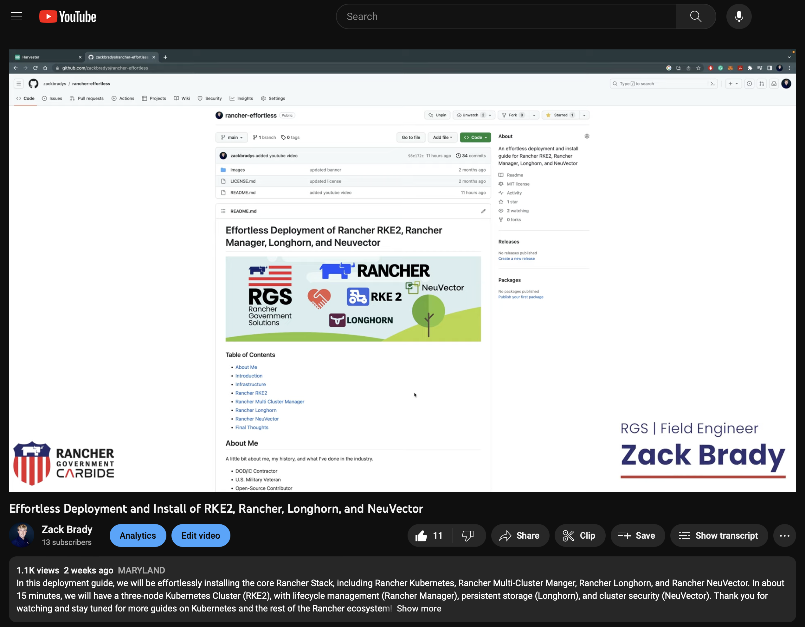
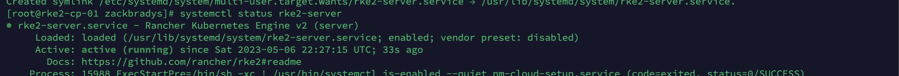
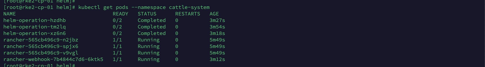
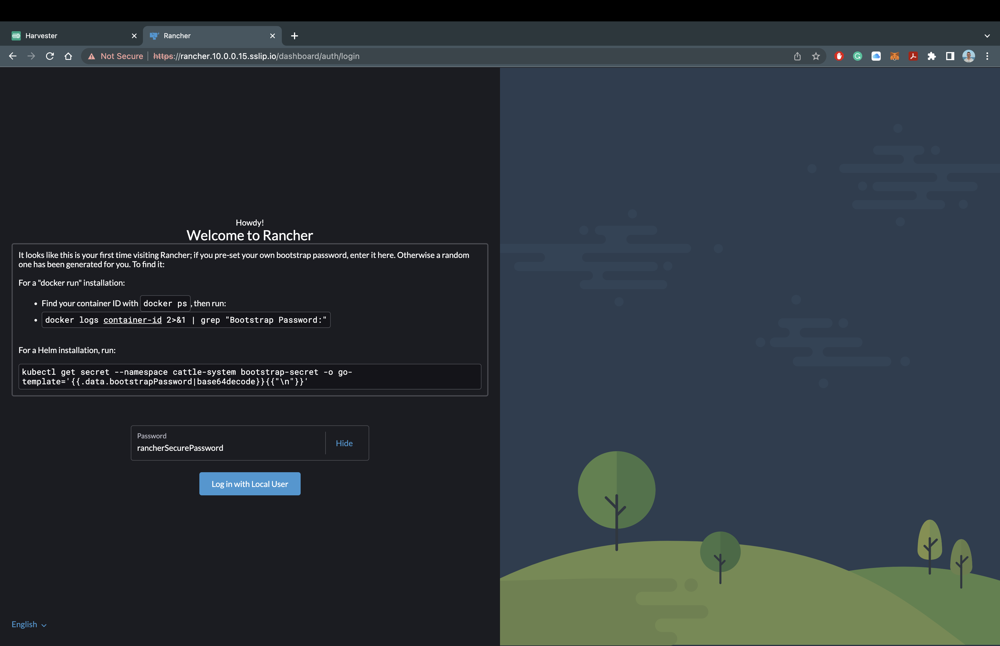
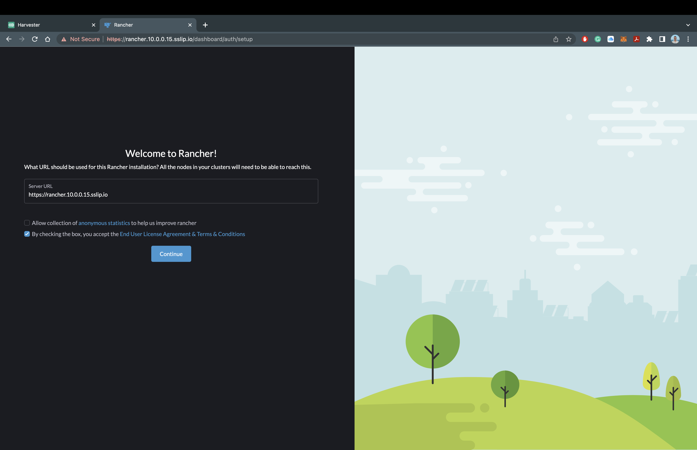
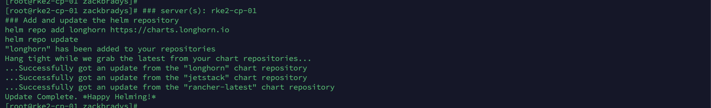
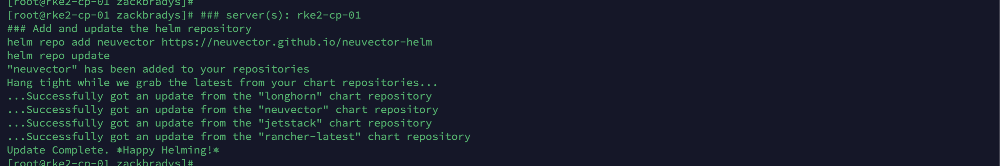
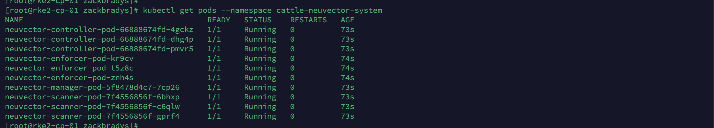

# Fácil instalación de RKE2, Rancher Manager, Longhorn y Neuvector

### Tabla de contenidos

- [Acerca de mí](#Acerca-de-mí)
- [Introduction](#Introducción)
- [Watch the Video](#watch-the-video)
- [Infrastructure](#infrastructure)
- [Rancher Kubernetes (RKE2)](#rancher-kubernetes-rke2)
- [Rancher Multi Cluster Manager](#rancher-multi-cluster-manager)
- [Rancher Longhorn](#rancher-longhorn)
- [Rancher NeuVector](#rancher-neuvector)
- [Final Thoughts](#final-thoughts)

## Acerca de mí

Un poco de mi historia...

- Solution Architect para SUSE Mexico
- He trabajado en el area de preventa por más de 8 años
- Conocimiento en el area de on-premise, nube y ahora nube nativa
- Gamer de nacimiento y ganador de un torneo de Team Fortreess 2 en 2022

## Introducción

### Bienvenido a la Guía de Fácil instalación de Rancher.

En esta guía de despliegue, instalaremos toda el stack de SUSE Rancher, que incluye los siguientes productos:

- RKE2 (Distribución de Kubernetes) - [Click aquí para conocer más](https://ranchergovernment.com/products/rke2)
- Rancher Manager (Administración de Clústeres) - [Click aquí para conocer más](https://ranchergovernment.com/products/mcm)
- Longhorn (Almacenamiento) - [Click aquí para conocer más](https://www.ranchergovernment.com/products/longhorn)
- Neuvector (Seguridad) - [Click aquí para conocer más](https://ranchergovernment.com/neuvector)

### Prerequisitos

- Tres (3) servidores Linux con acceso a internet
- Herramientas para administrar los servidores (Terminal, VSCode, Termius etc...)

## Observa el video

Si prefieres seguir esta guía con un increíble video... por favor, haz clic a continuación. ()!

[]()

## Infraestructura

Para este despliegue, necesitamos tres servidores Linux para poder poner todo en marcha. Estaremos utilizando tres servidores OpenSUSE Leap 15.5 virtualizados, aprovisionados por VirtualBox. Cualquier distribución de Linux debería funcionar perfectamente, siempre que haya conectividad de red. Aquí tienes una lista de nuestros [Sistemas Operativos soportados](https://docs.rke2.io/install/requirements#operating-systems). Para configurar estos servidores para Rancher, necesitaremos que estén conectados a internet y sean accesibles desde tu computadora a través de `ssh`.

Aquí tienes una visión general de la arquitectura que utilizaremos para esta guía de despliegue:


Ejecutemos los siguientes comandos en cada uno de los nodos para asegurar que tengan los paquetes y configuraciones necesarias.

```bash
# server(s): rke2-cp-01, rke2-wk-01, and rke2-wk-02
# Instalar los paquetes
zypper --non-interactive install -n open-iscsi && systemctl enable iscsid && systemctl start iscsid

# Deshabilitar el Firewall
systemctl stop firewalld && systemctl disable firewalld
```

## Rancher Kubernetes (RKE2)

In order to configure and install RKE2, you need to have Control/Server nodes and Worker/Agent nodes. We will start by setting up the Control/Server node and then setting up the Worker/Agent nodes. There are many ways to accomplish this and this guide is meant for an effortless and minimal installation, please review the [rke2 docs](https://docs.rke2.io) for more information.

### RKE2 Control Node

Let's start by configuring the RKE2 Control/Server Node, by adding the configuration file. Since we are completing a effortless installation, we are only adding the RKE2 Token configuration option. I'm using `ssh` with `root` to access the `rke2-cp-01` server.

If you would like to see more ways to configure the RKE2 Control/Server, please check out the [rke2 server docs](https://docs.rke2.io/reference/server_config).

```bash
# server(s): rke2-cp-01
# Create the RKE2 Directory
mkdir -p /etc/rancher/rke2/

# Create the RKE2 Configuration File
cat << EOF >> /etc/rancher/rke2/config.yaml
token: rke2SecurePassword
EOF
```

Now that the configuration file is completed, let's install and start the RKE2 Control/Server Node:

```bash
# server(s): rke2-cp-01
# Download the RKE2 Control/Server
curl -sfL https://get.rke2.io | INSTALL_RKE2_CHANNEL=v1.28 INSTALL_RKE2_TYPE=server sh -

# Start the RKE2 Control/Server Service
systemctl enable rke2-server.service && systemctl start rke2-server.service
```

Let's verify that the RKE2 Control/Server is running using `systemctl status rke2-server`. It should look like this:



Now that we see that the RKE2 Control/Server is running, let's verify using `kubectl`.

```bash
# server(s): rke2-cp-01
# Symlink kubectl and containerd
sudo ln -s /var/lib/rancher/rke2/data/v1*/bin/kubectl /usr/bin/kubectl
sudo ln -s /var/run/k3s/containerd/containerd.sock /var/run/containerd/containerd.sock

# Update BASHRC
cat << EOF >> ~/.bashrc
export PATH=$PATH:/var/lib/rancher/rke2/bin:/usr/local/bin/
export KUBECONFIG=/etc/rancher/rke2/rke2.yaml
export CRI_CONFIG_FILE=/var/lib/rancher/rke2/agent/etc/crictl.yaml
alias k=kubectl
EOF

# Source BASHRC
source ~/.bashrc

# Verify RKE2 is Running/Ready
kubectl get nodes
```

It should look like this:


### RKE2 Worker Nodes

Again, let's start by configuring the RKE2 Worker/Agent Nodes, by adding the configuration file. Since we are completing a effortless installation, we are only adding the RKE2 Server and RKE2 Token configuration options. I'm using `ssh` with `root` to access the `rke2-wk-01` and `rke2-wk-02` servers.

If you woud like to see more ways to configure the RKE2 Worker/Agent, please check out the [rke2 agent docs](https://docs.rke2.io/reference/linux_agent_config).

_Note: You need to complete each of these steps on each worker/agent server._

```bash
# server(s): rke2-wk-01 and rke2-wk-02
# Create the RKE2 Directory
mkdir -p /etc/rancher/rke2/

# Create the RKE2 Configuration File
cat << EOF >> /etc/rancher/rke2/config.yaml
server: https://10.0.0.15:9345
token: rke2SecurePassword
EOF
```

Now that the configuration file is completed, let's install and start the RKE2 Worker/Agent Nodes:

```bash
# server(s): rke2-wk-01 and rke2-wk-02
# Download the RKE2 Worker/Agent
curl -sfL https://get.rke2.io | INSTALL_RKE2_CHANNEL=v1.28 INSTALL_RKE2_TYPE=agent sh -

# Start the RKE2 Worker/Agent Service
systemctl enable rke2-agent.service && systemctl start rke2-agent.service
```

Let's head back to the `rke2-cp-01` server and verify the worker/agent nodes sucessfully joined the cluster.

```bash
# server(s): rke2-cp-01
# Verify RKE2 is Running/Ready
kubectl get nodes
```

It should look like this:


Congraulations!! In a few minutes, you now have a RKE2 Cluster up and running! If you are already familiar with Kubernetes or RKE2, feel free to explore the cluster using `kubectl`. We are going to move onto installing the [Rancher Multi Cluster Manager](https://www.ranchergovernment.com/products/mcm), [Rancher Longhorn](https://www.ranchergovernment.com/products/longhorn), and [Rancher NeuVector](https://ranchergovernment.com/neuvector).

## Rancher Multi Cluster Manager

When most folks are starting their Kubernetes journey and their journey with Rancher Kubernetes, there is some confusion about the layers of Kubernetes. RKE2 is our Kubernetes distribution and the Rancher Multi Cluster Manager is our single pane of glass dashboard for managing any type of Kubernetes cluster (including our not to be named competitors). In order to run our Rancher Manager, we needed to start with a Kubernetes cluster and that's why we started with installing RKE2!

Let's get started with installing the Rancher Manager! In order to get the bits required to configure and install it, we need to use the [Helm CLI](https://helm.sh) for package management and then grab [Cert Manager](https://cert-manager.io) and the Rancher Manager. Let's use `ssh` with `root` to access the `rke2-cp-01` server and run the following commands:

```bash
# server(s): rke2-cp-01
# Download and Install Helm CLI
mkdir -p /opt/rancher/helm
cd /opt/rancher/helm

curl -fsSL -o get_helm.sh https://raw.githubusercontent.com/helm/helm/main/scripts/get-helm-3
chmod 755 get_helm.sh && ./get_helm.sh
mv /usr/local/bin/helm /usr/bin/helm
```

Now let's add the Helm Repositories for Cert Manager and the Rancher Manager!

```bash
# server(s): rke2-cp-01
# Add and Update the Helm Repositories
helm repo add jetstack https://charts.jetstack.io
helm repo add rancher-stable https://releases.rancher.com/server-charts/stable
helm repo update
```

It should look like this:


Now let's install Cert Manager with the following commands:

```bash
# server(s): rke2-cp-01
# Create the Cert Manager Namespace and Install Cert Manager
kubectl create namespace cert-manager

helm upgrade -i cert-manager jetstack/cert-manager --namespace cert-manager --set installCRDs=true

# Wait for the deployment and rollout
sleep 60

# Verify the status of Cert Manager
kubectl get pods --namespace cert-manager
```

It should look like this:


Now let's install the Rancher Manager with the following commands:

```bash
# server(s): rke2-cp-01
# Create the Rancher Namespace and Install Rancher
kubectl create namespace cattle-system

helm upgrade -i rancher rancher-stable/rancher --namespace cattle-system --set bootstrapPassword=rancherSecurePassword --set hostname=rancher.10.0.0.15.sslip.io

# Wait for the deployment and rollout
sleep 45

# Verify the status of the Rancher Manager
kubectl get pods --namespace cattle-system
```

It should look like this:



### Exploring the Rancher Manager

Once all the pods show as `Running` in the `cattle-system` namespace, you can access the Rancher Manager! Since we are using `sslip.io` as our Hostname/DNS, we do not need to configure anything else to access the Rancher Manager. Let's head over the domain name and take a look at the Rancher Manager!

For my deployment, I will be using `https://rancher.10.0.0.15.sslip.io` to access the Rancher Manager.

It should look like this:





You should now see the Rancher Manager asking for a password that we set during installation. For my deployment, I will be using `rancherSecurePassword`. You will also have to verify the Rancher Manager URL and accept the Terms and Conditions. Once that is completed... It should look like this:


You now have the Rancher Manager sucessfully deployed on our RKE2 Kubernetes Cluster!!! Remember there are many ways to configure and this was only a minimal installation. Feel free to explore everything you are able to do inside of the Rancher Manager, or we can move onto the next step of installing Rancher Longhorn.

## Rancher Longhorn

Let's move up the stack and start thinking about storage. Rancher Longhorn provides cloud native and highly available persistent block storage for Kubernetes, with backups and disaster recovery. In order to install Longhorn onto our cluster, we pretty much follow the same steps as we did for Cert Manager and the Rancher Manager.

Let's add the Helm Repository for Longhorn!

```bash
# server(s): rke2-cp-01
# Add and Update the Helm Repository
helm repo add longhorn https://charts.longhorn.io
helm repo update
```

It should look like this:



Now let's install Longhorn with the following commands:

```bash
# server(s): rke2-cp-01
# Create the Longhorn Namespace and Install Longhorn
kubectl create namespace longhorn-system

helm upgrade -i longhorn longhorn/longhorn --namespace longhorn-system --set ingress.enabled=true --set ingress.host=longhorn.10.0.0.15.sslip.io

# Wait for the deployment and rollout
sleep 30

# Verify the status of Longhorn
kubectl get pods --namespace longhorn-system
```

It should look like this:


### Exploring Rancher Longhorn

Once all the pods show as `Running` in the `longhorn-system` namespace, you can access Rancher Longhorn! Just like the Rancher Manager, we are utilizing `sslip.io`, so there is no additional configuration required to access Longhorn. Let's head over to the domain name.

For my deployment, I will be using `https://longhorn.10.0.0.15.sslip.io` to access Rancher Longhorn.

It should look like this:


You now have Rancher Longhorn successfully deployed on our RKE2 Kuberenetes Cluster with the Rancher Manager!! Feel free to explore the Longhorn dashboard and see how easy it is to manage your volumes, backup to an S3 Bucket, or setup cross-cluster disaster recovery. Once you're ready, let's move onto Rancher NeuVector.

## Rancher NeuVector

Let's add the Helm Repository for NeuVector!

```bash
# server(s): rke2-cp-01
# Add and Update the Helm Repository
helm repo add neuvector https://neuvector.github.io/neuvector-helm
helm repo update
```

It should look like this:



Now let's install NeuVector with the following commands:

```bash
# server(s): rke2-cp-01
# Create the NeuVector Namespace and Install NeuVector
kubectl create namespace cattle-neuvector-system

helm upgrade -i neuvector neuvector/core --namespace cattle-neuvector-system --set k3s.enabled=true --set manager.ingress.enabled=true --set manager.svc.type=ClusterIP --set controller.pvc.enabled=true --set manager.ingress.host=neuvector.10.0.0.15.sslip.io --set global.cattle.url=https://rancher.10.0.0.15.sslip.io --set controller.ranchersso.enabled=true --set rbac=true

# Wait for the deployment and rollout
sleep 30

# Verify the status of Longhorn
kubectl get pods --namespace cattle-neuvector-system
```

It should look like this:



### Exploring Rancher NeuVector

Once all the pods show as `Running` in the `cattle-neuvector-system` namespace, you can access Rancher NeuVector! Just like the Rancher Manager and Rancher Longhorn, we are utilizing `sslip.io`, so there is no additional configuration required to access NeuVector. Let's head over to the domain name.

For my deployment, I will be using `https://neuvector.10.0.0.15.sslip.io` to access Rancher NeuVecutor.

It should look like this:


You should now see NeuVector asking for a the default username and password. The default username is `admin` and the default password is `admin`.

It should look like this:


You now have Rancher NeuVector deployed on our RKE2 Kuberenetes Cluster with the Rancher Manager and Rancher Longhorn!! Feel free to explore the NeuVector and run vulneriablity scans, investigate cluster assets, or check out your network activity. Here is where we would usually recommend users to try creating a new cluster or deploying a few test applications to see the true power behind Rancher. For now, we're going to move onto our final thoughts...

## Final Thoughts

In a few easy steps and a few minutes of your time, you have the core Rancher Stack deployed out and ready for use. I would say that statement alone is a very powerful considering the alternatives out there.

If you have any issues with this deployment guide, please submit an issue or merge on this repo. Feel free to reach out to me as well!
