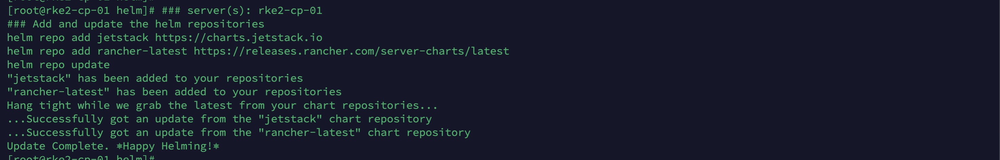
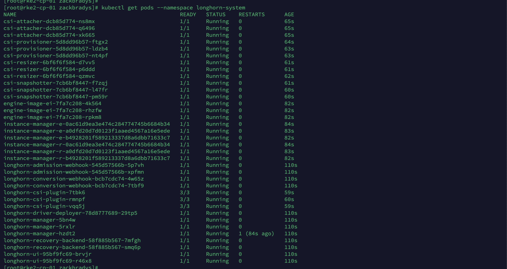
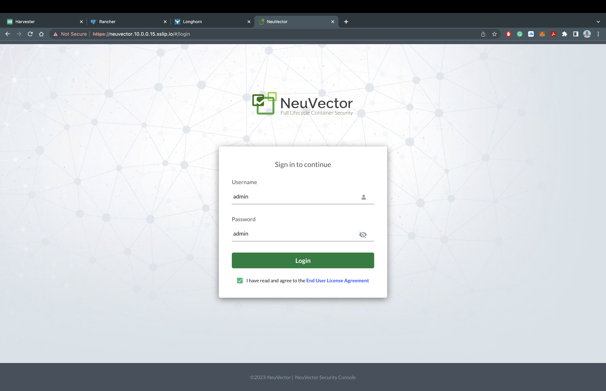

# Fácil instalación de RKE2, Rancher Manager, Longhorn y Neuvector

### Tabla de contenidos

- [Acerca de mí](#Acerca-de-mí)
- [Introducción](#Introducción)
- [Observa el video](#Observa-el-video)
- [Infrastructura](#Infrastructura)
- [Rancher Kubernetes (RKE2)](#rancher-kubernetes-rke2)
- [Rancher Multi Cluster Manager](#rancher-multi-cluster-manager)
- [Rancher Longhorn](#rancher-longhorn)
- [Rancher NeuVector](#rancher-neuvector)
- [Conclusión](#Conclusión)

## Acerca de mí

Un poco de mi historia...

- Solution Architect para SUSE Mexico
- He trabajado en el area de preventa por más de 8 años
- Conocimiento en el area de on-premise, nube y ahora nube nativa
- Gamer de nacimiento y ganador de un torneo de Team Fortreess 2 en 2022

## Introducción

### Bienvenido a la Guía de Fácil instalación de Rancher.

En esta guía de despliegue, instalaremos toda el stack de SUSE Rancher, que incluye los siguientes productos:

- RKE2 (Distribución de Kubernetes) - [Click aquí para conocer más](https://ranchergovernment.com/products/rke2)
- Rancher Manager (Administración de Clústeres) - [Click aquí para conocer más](https://ranchergovernment.com/products/mcm)
- Longhorn (Almacenamiento) - [Click aquí para conocer más](https://www.ranchergovernment.com/products/longhorn)
- Neuvector (Seguridad) - [Click aquí para conocer más](https://ranchergovernment.com/neuvector)

### Prerequisitos

- Tres (3) servidores Linux con acceso a internet
- Herramientas para administrar los servidores (Terminal, VSCode, Termius etc...)

## Observa el video

Si prefieres seguir esta guía con un increíble video... por favor, haz clic a continuación. ()!

[]()

## Infraestructura

Para este despliegue, necesitamos tres servidores Linux para poder poner todo en marcha. Estaremos utilizando tres servidores OpenSUSE Leap 15.5 virtualizados, aprovisionados por VirtualBox. Cualquier distribución de Linux debería funcionar perfectamente, siempre que haya conectividad de red. Aquí tienes una lista de nuestros [Sistemas Operativos soportados](https://docs.rke2.io/install/requirements#operating-systems). Para configurar estos servidores para Rancher, necesitaremos que estén conectados a internet y sean accesibles desde tu computadora a través de `ssh`.

Aquí tienes una visión general de la arquitectura que utilizaremos para esta guía de despliegue:


Ejecutemos los siguientes comandos en cada uno de los nodos para asegurar que tengan los paquetes y configuraciones necesarias.

```bash
# server(s): rke2-cp-01, rke2-wk-01, and rke2-wk-02
# Instalar los paquetes
zypper --non-interactive install -n open-iscsi && systemctl enable iscsid && systemctl start iscsid

# Deshabilitar el Firewall
systemctl stop firewalld && systemctl disable firewalld
```

## Rancher Kubernetes (RKE2)

Para configurar e instalar RKE2, es necesario tener nodos de "control" y nodos de "worker". Comenzaremos configurando el nodo Control y luego configurando los nodos Worker. Hay muchas maneras de lograr esto y esta guía está diseñada para una instalación mínima y de manera fácil. Revise los [documentos de rke2] (https://docs.rke2.io) para obtener más información.

### RKE2 Control Node

Comencemos configurando el nodo de Control RKE2, agregando un archivo de configuración. Dado que estamos realizando una instalación sencilla, utilizaremos la opción de configuración por token para RKE2. Estoy en una sesión `ssh` con `root` para acceder al servidor `rke2-cp-01`.

Si deseas ver más formas de configurar el nodo de Control de RKE2, consulte los [documentos del servidor rke2] (https://docs.rke2.io/reference/server_config).

```bash
# server(s): rke2-cp-01
# Crear el directorio RKE2
mkdir -p /etc/rancher/rke2/

# Crea el archivo de configuración RKE2
cat << EOF >> /etc/rancher/rke2/config.yaml
token: rke2SecurePassword
EOF
```

Ahora que el archivo de configuración está completo, instalemos e iniciemos el nodo de Control de RKE2:

```bash
# server(s): rke2-cp-01
# Descarga la distribucion de RKE2 e instala en modo Control
curl -sfL https://get.rke2.io | INSTALL_RKE2_CHANNEL=v1.28 INSTALL_RKE2_TYPE=server sh -

# Inicie el servicio de Control de RKE2
systemctl enable rke2-server.service && systemctl start rke2-server.service
```

Verifiquemos que el nodo de Control se esté ejecutando usando `systemctl status rke2-server`. Debería verse así:


Ahora que vemos que el nodo de Control se está ejecutando con RKE2, verifiquemos usando `kubectl`.

```bash
# server(s): rke2-cp-01
# Enlace simbólico para kubectl y containerd
sudo ln -s /var/lib/rancher/rke2/data/v1*/bin/kubectl /usr/bin/kubectl
sudo ln -s /var/run/k3s/containerd/containerd.sock /var/run/containerd/containerd.sock

# Actualizar BASHRC
cat << EOF >> ~/.bashrc
export PATH=$PATH:/var/lib/rancher/rke2/bin:/usr/local/bin/
export KUBECONFIG=/etc/rancher/rke2/rke2.yaml
export CRI_CONFIG_FILE=/var/lib/rancher/rke2/agent/etc/crictl.yaml
alias k=kubectl
EOF

# Source BASHRC
source ~/.bashrc

# Verifique que RKE2 esté funcionando/listo
kubectl get nodes
```

Debería verse así:


### RKE2 Nodos Worker

Ahora comencemos configurando los nodos de Worker RKE2 agregando el archivo de configuración. Dado que estamos realizando una instalación sencilla,  utilizaremos la opción de configuración por token para RKE2 y la configuración de Worker. Estoy en una sesión de `ssh` con `root` para acceder a los servidores `rke2-wk-01` y `rke2-wk-02`.

Si desea ver más formas de configurar el nodo worker de RKE2, consulte los [documentos del agente rke2] (https://docs.rke2.io/reference/linux_agent_config).

_Nota: Debe completar cada uno de estos pasos en cada nodo de Worker._

```bash
# server(s): rke2-wk-01 and rke2-wk-02
# Crear el directorio RKE2
mkdir -p /etc/rancher/rke2/

# Cree el archivo de configuración RKE2
cat << EOF >> /etc/rancher/rke2/config.yaml
server: https://10.0.0.15:9345
token: rke2SecurePassword
EOF
```

Ahora que el archivo de configuración está completo, instalemos e iniciemos los nodos de Worker de RKE2:

```bash
# server(s): rke2-wk-01 and rke2-wk-02
# Descargar RKE2 e instalar en modo Worker
curl -sfL https://get.rke2.io | INSTALL_RKE2_CHANNEL=v1.28 INSTALL_RKE2_TYPE=agent sh -

# Inicie el servicio de Worker de RKE2
systemctl enable rke2-agent.service && systemctl start rke2-agent.service
```

Regresemos al servidor `rke2-cp-01` y verifiquemos que los nodos de Worker se unieron exitosamente al clúster.

```bash
# server(s): rke2-cp-01
# Verifica que RKE2 esté funcionando/listo
kubectl get nodes
```

Debería verse así:


Felicitaciones!! ¡Ya tiene su clúster RKE2 en funcionamiento! Si ya estás familiarizado con Kubernetes o RKE2, no dudes en explorar el clúster usando "kubectl". Ahora pasaremos a instalar [Rancher Multi Cluster Manager](https://www.ranchergovernment.com/products/mcm), [Rancher Longhorn](https://www.ranchergovernment.com/products/longhorn), y [Rancher NeuVector](https://ranchergovernment.com/neuvector).

## Rancher Multi Cluster Manager

Cuando la mayoría de las personas comienzan su viaje con Kubernetes y con Rancher Kubernetes, existe cierta confusión sobre las capas de Kubernetes. RKE2 es nuestra distribución de Kubernetes y Rancher Multi Cluster Manager es nuestro panel de control para administrar cualquier tipo de clúster de Kubernetes (incluidos cualquiera listados por la CNCF). Para ejecutar nuestro Rancher Manager, necesitábamos primero contar con un clúster de Kubernetes y es por eso que comenzamos con la instalación de RKE2.

¡Comencemos con la instalación de Rancher Manager! Para obtener los componentes necesarios para configurarlo e instalarlo, necesitamos usar [Helm CLI](https://helm.sh) como administrador de paquetes (charts) para k8s y luego instalar el chart [Cert Manager](https://cert-manager.io) y finalmente el chart de Rancher Manager. Usemos `ssh` con `root` para acceder al servidor `rke2-cp-01` y ejecutar los siguientes comandos:

```bash
# server(s): rke2-cp-01
# Descargar e instalar Helm CLI
mkdir -p /opt/rancher/helm
cd /opt/rancher/helm

curl -fsSL -o get_helm.sh https://raw.githubusercontent.com/helm/helm/main/scripts/get-helm-3
chmod 755 get_helm.sh && ./get_helm.sh
mv /usr/local/bin/helm /usr/bin/helm
```

Ahora agreguemos los repositorios de Helm para Cert Manager y Rancher Manager:

```bash
# server(s): rke2-cp-01
# Add and Update the Helm Repositories
helm repo add jetstack https://charts.jetstack.io
helm repo add rancher-stable https://releases.rancher.com/server-charts/stable
helm repo update
```

It should look like this:



Now let's install Cert Manager with the following commands:

```bash
# server(s): rke2-cp-01
# Create the Cert Manager Namespace and Install Cert Manager
kubectl create namespace cert-manager

helm upgrade -i cert-manager jetstack/cert-manager --namespace cert-manager --set installCRDs=true

# Wait for the deployment and rollout
sleep 60

# Verify the status of Cert Manager
kubectl get pods --namespace cert-manager
```

It should look like this:


Now let's install the Rancher Manager with the following commands:

```bash
# server(s): rke2-cp-01
# Create the Rancher Namespace and Install Rancher
kubectl create namespace cattle-system

helm upgrade -i rancher rancher-stable/rancher --namespace cattle-system --set bootstrapPassword=rancherSecurePassword --set hostname=rancher.10.0.0.15.sslip.io

# Wait for the deployment and rollout
sleep 45

# Verify the status of the Rancher Manager
kubectl get pods --namespace cattle-system
```

It should look like this:


### Exploring the Rancher Manager

Once all the pods show as `Running` in the `cattle-system` namespace, you can access the Rancher Manager! Since we are using `sslip.io` as our Hostname/DNS, we do not need to configure anything else to access the Rancher Manager. Let's head over the domain name and take a look at the Rancher Manager!

For my deployment, I will be using `https://rancher.10.0.0.15.sslip.io` to access the Rancher Manager.

It should look like this:


You should now see the Rancher Manager asking for a password that we set during installation. For my deployment, I will be using `rancherSecurePassword`. You will also have to verify the Rancher Manager URL and accept the Terms and Conditions. Once that is completed... It should look like this:


You now have the Rancher Manager sucessfully deployed on our RKE2 Kubernetes Cluster!!! Remember there are many ways to configure and this was only a minimal installation. Feel free to explore everything you are able to do inside of the Rancher Manager, or we can move onto the next step of installing Rancher Longhorn.

## Rancher Longhorn

Let's move up the stack and start thinking about storage. Rancher Longhorn provides cloud native and highly available persistent block storage for Kubernetes, with backups and disaster recovery. In order to install Longhorn onto our cluster, we pretty much follow the same steps as we did for Cert Manager and the Rancher Manager.

Let's add the Helm Repository for Longhorn!

```bash
# server(s): rke2-cp-01
# Add and Update the Helm Repository
helm repo add longhorn https://charts.longhorn.io
helm repo update
```

It should look like this:


Now let's install Longhorn with the following commands:

```bash
# server(s): rke2-cp-01
# Create the Longhorn Namespace and Install Longhorn
kubectl create namespace longhorn-system

helm upgrade -i longhorn longhorn/longhorn --namespace longhorn-system --set ingress.enabled=true --set ingress.host=longhorn.10.0.0.15.sslip.io

# Wait for the deployment and rollout
sleep 30

# Verify the status of Longhorn
kubectl get pods --namespace longhorn-system
```

It should look like this:



### Exploring Rancher Longhorn

Once all the pods show as `Running` in the `longhorn-system` namespace, you can access Rancher Longhorn! Just like the Rancher Manager, we are utilizing `sslip.io`, so there is no additional configuration required to access Longhorn. Let's head over to the domain name.

For my deployment, I will be using `https://longhorn.10.0.0.15.sslip.io` to access Rancher Longhorn.

It should look like this:


You now have Rancher Longhorn successfully deployed on our RKE2 Kuberenetes Cluster with the Rancher Manager!! Feel free to explore the Longhorn dashboard and see how easy it is to manage your volumes, backup to an S3 Bucket, or setup cross-cluster disaster recovery. Once you're ready, let's move onto Rancher NeuVector.

## Rancher NeuVector

Let's add the Helm Repository for NeuVector!

```bash
# server(s): rke2-cp-01
# Add and Update the Helm Repository
helm repo add neuvector https://neuvector.github.io/neuvector-helm
helm repo update
```

It should look like this:


Now let's install NeuVector with the following commands:

```bash
# server(s): rke2-cp-01
# Create the NeuVector Namespace and Install NeuVector
kubectl create namespace cattle-neuvector-system

helm upgrade -i neuvector neuvector/core --namespace cattle-neuvector-system --set k3s.enabled=true --set manager.ingress.enabled=true --set manager.svc.type=ClusterIP --set controller.pvc.enabled=true --set manager.ingress.host=neuvector.10.0.0.15.sslip.io --set global.cattle.url=https://rancher.10.0.0.15.sslip.io --set controller.ranchersso.enabled=true --set rbac=true

# Wait for the deployment and rollout
sleep 30

# Verify the status of Longhorn
kubectl get pods --namespace cattle-neuvector-system
```

It should look like this:


### Exploring Rancher NeuVector

Once all the pods show as `Running` in the `cattle-neuvector-system` namespace, you can access Rancher NeuVector! Just like the Rancher Manager and Rancher Longhorn, we are utilizing `sslip.io`, so there is no additional configuration required to access NeuVector. Let's head over to the domain name.

For my deployment, I will be using `https://neuvector.10.0.0.15.sslip.io` to access Rancher NeuVecutor.

It should look like this:



You should now see NeuVector asking for a the default username and password. The default username is `admin` and the default password is `admin`.

It should look like this:


You now have Rancher NeuVector deployed on our RKE2 Kuberenetes Cluster with the Rancher Manager and Rancher Longhorn!! Feel free to explore the NeuVector and run vulneriablity scans, investigate cluster assets, or check out your network activity. Here is where we would usually recommend users to try creating a new cluster or deploying a few test applications to see the true power behind Rancher. For now, we're going to move onto our final thoughts...

## Conclusión

In a few easy steps and a few minutes of your time, you have the core Rancher Stack deployed out and ready for use. I would say that statement alone is a very powerful considering the alternatives out there.

If you have any issues with this deployment guide, please submit an issue or merge on this repo. Feel free to reach out to me as well!
